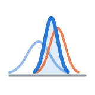
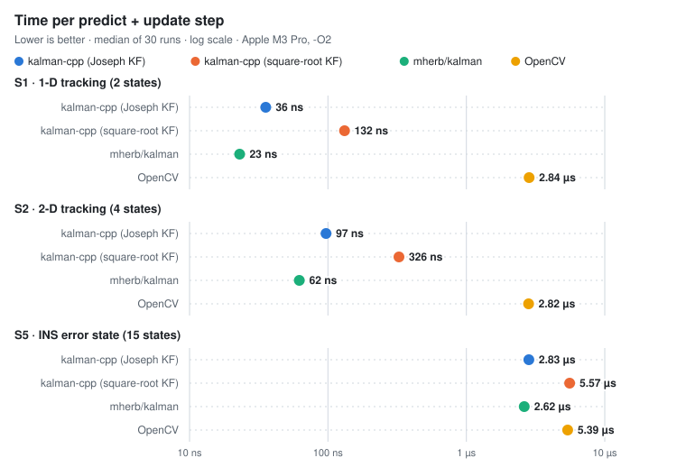
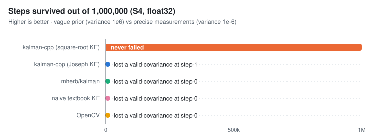
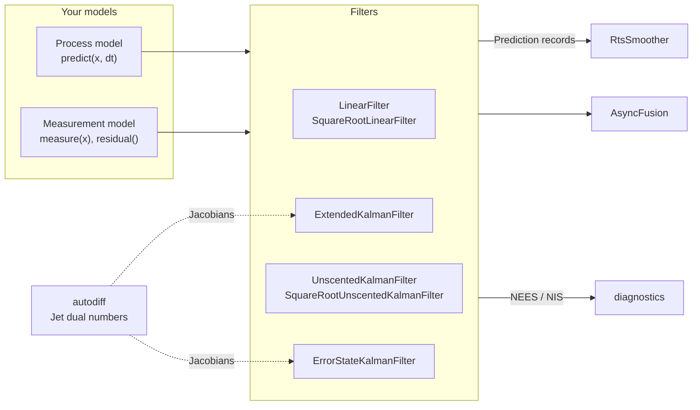

<p align="center">
  
</p>

<h1 align="center">kalman-cpp</h1>

<p align="center">
  <strong>Header-only C++20 Kalman filters: compile-time checked, automatic Jacobians, numerically robust</strong>
</p>

<p align="center">
  
  
  
  <a href="./LICENSE"></a>
  
  
</p>

<p align="center">
  
  
  
  
</p>

<p align="center">
  <a href="#quick-start"><strong>Quick Start</strong></a> ·
  <a href="#filters"><strong>Filters</strong></a> ·
  <a href="#benchmarks"><strong>Benchmarks</strong></a> ·
  <a href="#architecture"><strong>Architecture</strong></a> ·
  <a href="#testing"><strong>Testing</strong></a> ·
  <a href="#roadmap"><strong>Roadmap</strong></a> ·
  <a href="./kalman-cpp-repo-guide.md"><strong>Design Guide</strong></a>
</p>

---

kalman-cpp is a header-only family of Kalman filters built on Eigen's fixed-size matrices:
- linear, square-root, extended, unscented, square-root unscented and error-state filters
- an RTS smoother
- an asynchronous multi-sensor fusion engine
- NEES/NIS consistency diagnostics

The compiler checks matrix dimensions. You write a nonlinear model once, and its Jacobians are derived by forward-mode autodiff. Every claim below is backed by a test or a reproducible benchmark against OpenCV and mherb/kalman.

<p align="center">
  <picture>
    <source media="(prefers-color-scheme: dark)" srcset="docs/assets/bench-time-dark.svg" />
    
  </picture>
</p>

## 📰 Status

<table>
  <tr>
    <td align="right" valign="top" width="120"></td>
    <td valign="top"><strong>Filter family</strong>: linear KF, EKF with autodiff, UKF, square-root UKF, RTS smoother, async fusion, and the SO(3) error-state filter</td>
  </tr>
  <tr>
    <td align="right" valign="top"></td>
    <td valign="top"><strong>Proof by tests</strong>: equivalence with OpenCV to 1e-9, compile-fail tests, Monte Carlo NEES/NIS checks, and float32 stability</td>
  </tr>
  <tr>
    <td align="right" valign="top"></td>
    <td valign="top"><strong>Benchmarks</strong>: five frozen scenarios, one command, and a published CSV. <a href="#benchmarks">Results →</a></td>
  </tr>
  <tr>
    <td align="right" valign="top"></td>
    <td valign="top"><strong>CI</strong>: the workflow is written and verified locally on macOS, and is waiting for its first GitHub run (Linux GCC/Clang, Windows MSVC)</td>
  </tr>
  <tr>
    <td align="right" valign="top"></td>
    <td valign="top"><strong>Docs and packaging</strong>: Doxygen, tutorials, vcpkg/Conan, and a ROS 2 example. <a href="#roadmap">Roadmap →</a></td>
  </tr>
</table>

<a id="highlights"></a>

## ✨ Highlights

<table align="center">
  <tr align="center" valign="top">
    <td width="33%">
      <strong>📐 Compile-time safety</strong><br/><br/>
      Fixed-size Eigen types and C++20 concepts. Passing a 3-element measurement to a 2-measurement filter does not compile. OpenCV's <code>cv::Mat</code> only checks sizes at runtime.<br/><br/>
      <a href="./include/kalman/concepts.hpp">concepts.hpp →</a>
    </td>
    <td width="33%">
      <strong>🤖 Automatic Jacobians</strong><br/><br/>
      Write <code>f(x)</code> and <code>h(x)</code> once, templated on the scalar. In-house forward-mode dual numbers derive exact Jacobians with no extra dependency, and agree with analytic ones to 1e-12.<br/><br/>
      <a href="./include/kalman/autodiff.hpp">autodiff.hpp →</a>
    </td>
    <td width="33%">
      <strong>🧰 Full filter family</strong><br/><br/>
      Linear, square-root linear, extended, unscented, square-root unscented and error-state filters, all with the same <code>predict(model, dt, Q)</code> / <code>update(model, z, R)</code> API.<br/><br/>
      <a href="#filters">Which filter? →</a>
    </td>
  </tr>
  <tr align="center" valign="top">
    <td width="33%">
      <strong>🛰️ Asynchronous fusion</strong><br/><br/>
      Multi-rate sensors with different measurement sizes. Late measurements are handled exactly by rewinding and replaying, so out-of-order input gives the same result as in-order input to 1e-12.<br/><br/>
      <a href="./include/kalman/fusion.hpp">fusion.hpp →</a>
    </td>
    <td width="33%">
      <strong>🧭 Orientation on SO(3)</strong><br/><br/>
      An error-state filter on any manifold you describe with ⊞/⊟. Its process, measurement and reset Jacobians are all computed by autodiff. It recovers attitude from a 30° initial error.<br/><br/>
      <a href="./include/kalman/error_state.hpp">error_state.hpp →</a>
    </td>
    <td width="33%">
      <strong>🛡️ Numerically robust</strong><br/><br/>
      Joseph-form updates, positive-definiteness checks with clean rejection, and square-root filters. These survive an ill-conditioned float32 problem that breaks OpenCV, mherb/kalman and our own covariance form.<br/><br/>
      <a href="#benchmarks">Stability results →</a>
    </td>
  </tr>
  <tr align="center" valign="top">
    <td width="33%">
      <strong>⏪ RTS smoothing</strong><br/><br/>
      One smoother for every filter, including the unscented RTS smoother. It equals the exact batch solution to 1e-9, gaps in the measurements included.<br/><br/>
      <a href="./include/kalman/smoother.hpp">smoother.hpp →</a>
    </td>
    <td width="33%">
      <strong>📏 Consistency diagnostics</strong><br/><br/>
      NEES/NIS with exact chi-square bounds (regularized incomplete gamma, no tables) and Monte Carlo checks that flag a mistuned filter.<br/><br/>
      <a href="./include/kalman/diagnostics.hpp">diagnostics.hpp →</a>
    </td>
    <td width="33%">
      <strong>📦 Zero allocations</strong><br/><br/>
      Fixed-size types throughout: no heap allocation in the predict/update loop, measured by interposing <code>malloc</code>. The library is header-only, and its only dependency is Eigen.<br/><br/>
      <a href="#quick-start">Get started →</a>
    </td>
  </tr>
</table>

<a id="benchmarks"></a>

## 📊 Benchmarks

Every library gets the same frozen inputs (`tests/vectors/`, checked with SHA-256), the same precision and the same compiler flags. Only predict+update is timed.

| Scenario | Metric | kalman-cpp | mherb/kalman | OpenCV |
|---|---|---|---|---|
| **S1** 1-D tracking (2 states) | time per step | 36 ns · **80× faster than OpenCV** | **23 ns** | 2.84 µs |
| **S2** 2-D tracking (4 states) | time per step | 97 ns · **29× faster than OpenCV** | **62 ns** | 2.82 µs |
| **S5** INS error state (15 states) | time per step | 2.83 µs · **1.9× faster than OpenCV** | **2.62 µs** | 5.39 µs |
| **S3** range-bearing, nonlinear | UKF RMSE | 5.35 | 5.35 | **5.29** |
| **S4** ill-conditioned, float32 | steps survived (of 1M) | **1,000,000** (square-root KF) | 0 | 0 |
| **S2** | heap allocations per run | **0** | **0** | **0** |
| **S1, S2, S5** | agreement with ours | n/a | 1e-12 | 1e-12 |

<p align="center">
  <picture>
    <source media="(prefers-color-scheme: dark)" srcset="docs/assets/bench-stability-dark.svg" />
    
  </picture>
</p>

- **Speed trade-off:** mherb/kalman is faster on tiny problems because it uses the short-form update `P −= K·H·P`. Ours pays for the Joseph form, a positive-definiteness check and NIS on every step. That same short form is why it fails S4.
- **Stability (S4):** every covariance-form filter, ours included, loses information in float32 at the first predict. A 1e-6 variance added to 1e4 rounds away. The square-root filter carries the Cholesky factor instead and keeps the right answer.
- **Nonlinear tracking (S3):**
  - The OpenCV EKF is built on `cv::KalmanFilter` by re-linearizing every step. The OpenCV UKF comes from the contrib `tracking` module.
  - Neither OpenCV nor mherb/kalman can handle angles that wrap around ±π, so their runners unwrap bearings the way a user would.
  - Without that workaround their UKFs diverge (RMSE about 60).
- **Machine:** Apple M3 Pro, Apple clang 21, `-O2 -mcpu=native`. mherb/kalman is pinned at `9f40c2f` (its last commit was in 2018), and OpenCV is 5.0.0.

Reproduce everything with one command: `./scripts/run_benchmarks.sh`. It writes `results/results.csv`, the table below, and the charts.

<details>
<summary><strong>Full results table</strong> (generated; also includes RMSE, NEES and the naive filter)</summary>

<!-- BENCH:START -->
| Scenario | Filter | Precision | Metric | kalman-cpp | kalman-cpp-sqrt | mherb-kalman | naive | opencv | Ours vs best other |
|---|---|---|---|---|---|---|---|---|---|
| S1 | KF | float64 | max_abs_diff (state) | n/a | n/a | 2.728e-12 | 2.728e-12 | 2.728e-12 | n/a |
| S1 | KF | float64 | nees (-) | 1.991 | n/a | 1.991 | 1.991 | 1.991 | – |
| S1 | KF | float64 | rmse (state) | 0.3874 | n/a | 0.3874 | 0.3874 | 0.3874 | 1.00x |
| S1 | KF | float64 | time_per_step (ns) | 35.5 | 131.8 | 23 | n/a | 2840 | 0.65x |
| S2 | KF | float64 | heap_allocations (count) | 0 | 0 | 0 | n/a | 0 | – |
| S2 | KF | float64 | max_abs_diff (state) | n/a | n/a | 9.095e-13 | 1.364e-12 | 1.364e-12 | n/a |
| S2 | KF | float64 | nees (-) | 4.035 | n/a | 4.035 | 4.035 | 4.035 | – |
| S2 | KF | float64 | rmse (state) | 0.569 | n/a | 0.569 | 0.569 | 0.569 | 1.00x |
| S2 | KF | float64 | time_per_step (ns) | 96.81 | 325.8 | 62.06 | n/a | 2815 | 0.64x |
| S3 | EKF | float64 | nees (-) | 17.9 | n/a | 17.9 | n/a | 17.9 | – |
| S3 | EKF | float64 | rmse (state) | 5.72 | n/a | 5.72 | n/a | 5.72 | 1.00x |
| S3 | UKF | float64 | nees (-) | 8.778 | n/a | 8.748 | n/a | 8.735 | – |
| S3 | UKF | float64 | rmse (state) | 5.355 | n/a | 5.346 | n/a | 5.29 | 0.99x |
| S4 | KF | float32 | steps_to_failure (steps) | 1 | 1e+06 | 0 | 0 | 0 | ∞ |
| S5 | KF | float64 | nees (-) | 18 | n/a | 18 | 18 | 18 | – |
| S5 | KF | float64 | rmse (state) | 1.05 | n/a | 1.05 | 1.05 | 1.05 | 1.00x |
| S5 | KF | float64 | time_per_step (ns) | 2830 | 5573 | 2619 | n/a | 5392 | 0.93x |
<!-- BENCH:END -->

</details>

<a id="quick-start"></a>

## 🚀 Quick Start

**Requirements:** CMake ≥ 3.20 and a C++20 compiler. Eigen 3.4 is fetched automatically if you build from source.

```cmake
add_subdirectory(kalman-cpp)          # or: find_package(kalman) after cmake --install
target_link_libraries(my_app PRIVATE kalman::kalman)
```

**A linear filter.** Dimensions are part of the type ([`examples/quickstart_kf.cpp`](./examples/quickstart_kf.cpp)):

```cpp
#include <kalman/kalman.hpp>

using KF = kalman::LinearFilter</*N=*/2, /*M=*/1>;  // state [position, velocity], measure position
KF::Transition F;  F << 1, 0.1, 0, 1;
KF::Observation H; H << 1, 0;
KF kf(F, H, 1e-3 * KF::Cov::Identity(), KF::MeasCov::Constant(0.25), KF::State(0.0, 0.0), 10.0 * KF::Cov::Identity());

kf.predict();
kf.update(KF::Measurement(0.11));  // a 2-element measurement would not compile
```

**A nonlinear filter with automatic Jacobians** ([`examples/quickstart_ekf.cpp`](./examples/quickstart_ekf.cpp)):

```cpp
struct RangeBearing {
    template <typename T>  // templated on the scalar, so the filter can differentiate it
    Eigen::Matrix<T, 2, 1> measure(const Eigen::Matrix<T, 4, 1>& x) const {
        using std::atan2;
        using std::sqrt;
        return Eigen::Matrix<T, 2, 1>(sqrt(x(0) * x(0) + x(1) * x(1)), atan2(x(1), x(0)));
    }
};

kalman::ExtendedKalmanFilter<4> ekf(x0, P0);
ekf.predict(ConstantVelocity{}, dt, Q);
ekf.update(RangeBearing{}, z, R);  // no hand-written Jacobians
```

**Build from source and run the tests:**

```bash
cmake -B build && cmake --build build
ctest --test-dir build                 # 65 tests; comparison tests too if OpenCV is installed
./build/examples/quickstart_ekf
```

<a id="filters"></a>

## 🧭 Which filter?

| You have | Use | Header |
|---|---|---|
| A linear model | `LinearFilter<N, M>` | [`linear_filter.hpp`](./include/kalman/linear_filter.hpp) |
| A linear model with a huge dynamic range, or float32 | `SquareRootLinearFilter<N, M>` | [`sqrt_linear_filter.hpp`](./include/kalman/sqrt_linear_filter.hpp) |
| A mildly nonlinear model | `ExtendedKalmanFilter<N>`, with autodiff or your own Jacobians | [`ekf.hpp`](./include/kalman/ekf.hpp) |
| A strongly nonlinear model | `UnscentedKalmanFilter<N>` or `SquareRootUnscentedKalmanFilter<N>` | [`ukf.hpp`](./include/kalman/ukf.hpp), [`sqrt_ukf.hpp`](./include/kalman/sqrt_ukf.hpp) |
| A state on a manifold (orientation) | `ErrorStateKalmanFilter<S>` with `SO3<T>` or your own state | [`error_state.hpp`](./include/kalman/error_state.hpp), [`so3.hpp`](./include/kalman/so3.hpp) |
| A recorded run to post-process | `RtsSmoother<N>` | [`smoother.hpp`](./include/kalman/smoother.hpp) |
| Several sensors at different rates, arriving late | `AsyncFusion<Filter, Process>` | [`fusion.hpp`](./include/kalman/fusion.hpp) |
| Doubts about your tuning | `diagnostics::ConsistencyCheck` | [`diagnostics.hpp`](./include/kalman/diagnostics.hpp) |

<a id="architecture"></a>

## 🏗 Architecture



| Component | Responsibility |
|---|---|
| **Concepts** | C++20 contracts for process, measurement and manifold models. They detect whether a model can be autodiffed or brings its own Jacobian. |
| **Autodiff** | `Jet<T, N>` dual numbers registered with Eigen. Math functions are found through argument-dependent lookup, so models are written once. |
| **Filters** | Every Gaussian update goes through one Joseph-form core, with a fixed-size Cholesky that rejects a non-positive-definite S without touching the state. |
| **Prediction records** | Each `predict()` stores its mean, covariance and cross-covariance, so one smoother serves every filter. |
| **AsyncFusion** | Keeps a snapshot after every buffered measurement, inserts late measurements in time order and replays, with a bounded horizon. |
| **Diagnostics** | Exact chi-square quantiles and Monte Carlo consistency checks. |

<a id="testing"></a>

## 🧪 Testing

- **Unit tests (Catch2):**
  - closed-form answers and the exact batch solution for the smoother
  - analytic Jacobians, including the SO(3) reset Jacobian
  - out-of-order fusion compared against in-order fusion
  - Monte Carlo consistency
- **Compile-fail tests:** code that must not compile, such as size mismatches or a model that can't be differentiated, fails for the intended reason.
- **Comparison tests:** equivalence with `cv::KalmanFilter`, float32 stability over 1M steps, and the UKF against an OpenCV-based EKF.
- **Quality gates:**
  - `-Wall -Wextra -Wpedantic -Wshadow -Wconversion` treated as errors
  - ASan + UBSan
  - clang-tidy and clang-format
  - 99.7% line coverage of the library
- **Mutation-checked:** the key tests were verified to fail when the code they guard is deliberately broken.
- **CI** ([`.github/workflows/ci.yml`](./.github/workflows/ci.yml)): Linux GCC/Clang, macOS AppleClang, Windows MSVC, sanitizers, clang-tidy, coverage, and an OpenCV comparison job that publishes `comparison.md`.

<a id="roadmap"></a>

## 🗺 Roadmap

| Item | Description |
|---|---|
| **First CI run** | Push to GitHub and fix whatever Linux GCC, Windows MSVC and Ubuntu's OpenCV 4.x turn up. |
| **Speed regression gate** | Fail CI when a release is more than 10% slower than the last one, once there is a release to compare against. |
| **Close the small-problem gap** | Recover the 1.5× against mherb/kalman on 2–4-state filters without giving up the Joseph form. |
| **Documentation** | Doxygen API reference, plus tutorials for a constant-velocity tracker, GPS+IMU fusion and attitude estimation. |
| **Packaging** | Semantic-versioned releases, vcpkg and Conan Center ports, and a ROS 2 example package. |
| **Sister implementations** | C, Python and Rust versions that read the same frozen scenarios. |

## 🤝 Contributing

Bug reports, ideas and pull requests are welcome. Before opening a PR, run the same checks as CI:

```bash
git ls-files '*.hpp' '*.cpp' | grep -v '^bench/baselines/' | xargs clang-format --dry-run --Werror
cmake -B build -DKALMAN_WARNINGS_AS_ERRORS=ON && cmake --build build && ctest --test-dir build
```

## 📄 License

kalman-cpp is released under the [MIT License](./LICENSE).

It stands on [Eigen](https://eigen.tuxfamily.org) and is tested with [Catch2](https://github.com/catchorg/Catch2) and [Google Benchmark](https://github.com/google/benchmark). Thanks to [OpenCV](https://opencv.org) and [mherb/kalman](https://github.com/mherb/kalman), the baselines it is measured against.
